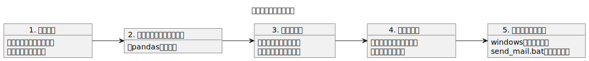

# 掃除当番のシフト&送信用メール作成ツール

## 使い方

### 1. 情報用意

#### 1.1 研究室のメンバー情報を準備
`resource/labo_member.txt`に1行づつメンバーの名前を入れておく.  
先頭に\#をつけると、その行は無視される. 留学中の人とかにつけよう.
~~~
Takashi
Hanako
#Takeshi
etc...
~~~

#### 1.2 自分の署名を準備
まず, `resource/`に`admin_profile.txt`ファイルを作成する.  
その後, 以下のような形式で自分の情報を書き込む.（これがそのままメールの署名になる）
~~~txt
山田孝
東北大学 工学研究科 修士1年
TEL：0123456789
MAIL:takashi.yamada.p9@dc.tohoku.ac.jp
~~~

### 2. pandas入れる
`pandas`が入ってなかったら入れる.  
いい感じに表示&csv出力用.
~~~bash
pip install pandas
~~~

### 3. シフトを作る
#### 3.1 シフト作成ファイルの実行
`src/make_shift.py`を実行.  
`--start_date`はシフトテーブルの1周目の月曜日にしておく.  
~~~bash
python src/make_shift.py --start_date 2023/10/2
~~~
#### 3.2 シフトの調整
シフトは`output/shift.csv`に作成される.  
このCSVをいじれば、自分のシフトを都合のいい週に調整できる.

### 4. メールのテンプレ作成
#### 4.1 メール作成ファイルの実行
`src/make_mail.py`を実行.  
さっき作ったシフトCSVファイルをもとに、いい感じのメールテンプレを作ってくれる.
~~~bash
python src/make_mail.py
~~~
実行結果はブラウザで表示される.

#### 4.2 メールのテンプレをコピー
表示された内容を全選択してgmailにコピペ.  
表示される内容は, `resource/mail_template.html`に1周目の日付とシフトテーブルを追加したもの.
(表示できないときは`output/mail.html`をchromeかなんかで表示する.)  

### 5. メールを定期送信化
windowsの定期実行機能にセットすることで、自動でメールを送るようにすることが可能  
※これは慣れてないと、ちょっと難しめ

#### 5.1 Gmailアドレスなどの設定
`envs.txt`内に環境変数を追加する
~~~bash
AP_PASSWORD=aaaaaaaaaaaaaaaaaa
MY_GMAIL_ADDRESS=takashi@dc.tohoku.ac.jp
TO_GMAIL_ADDRESS=yamada@dc.tohoku.ac.jp
~~~